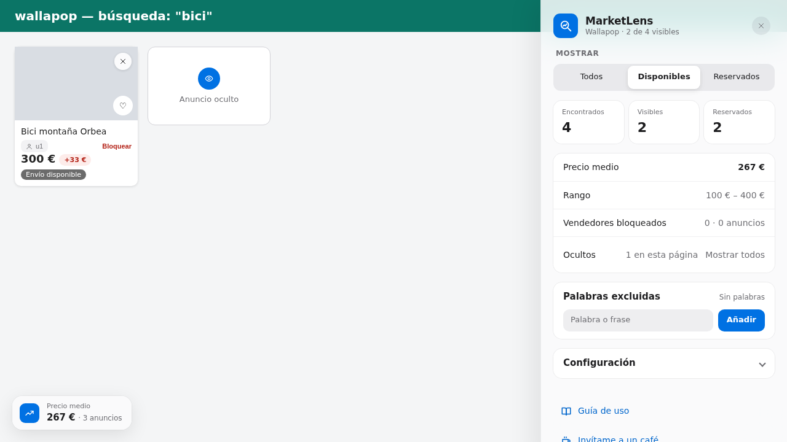
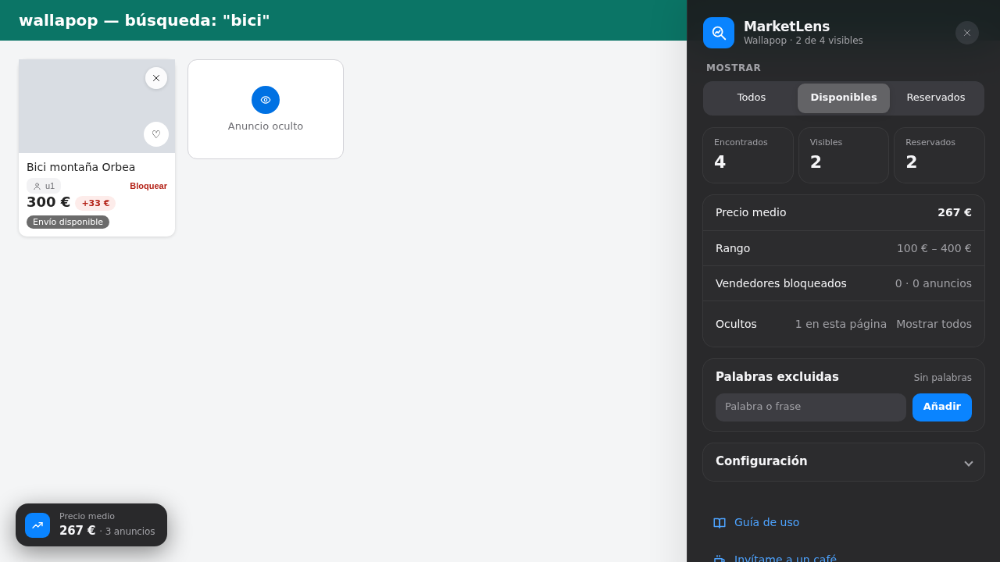
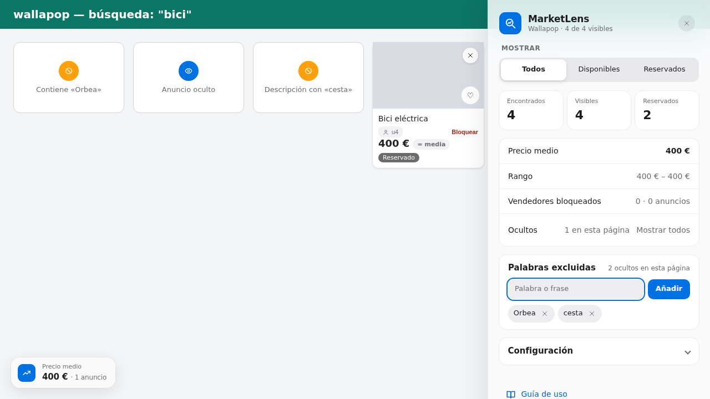
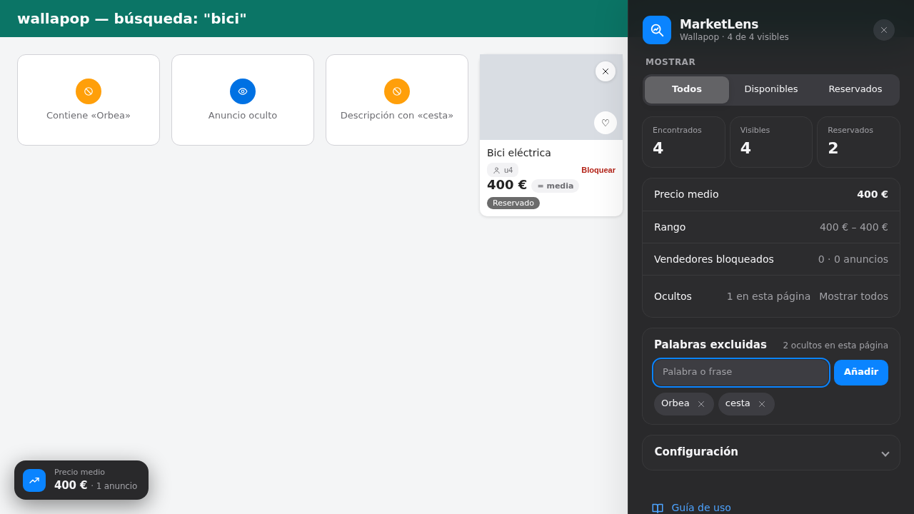
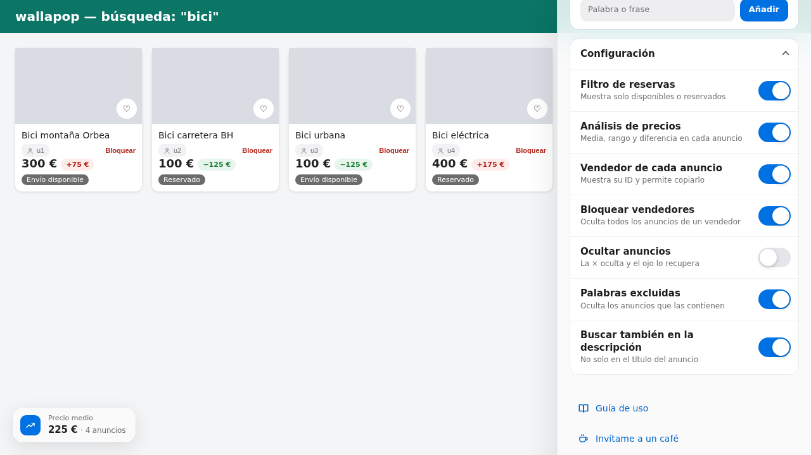
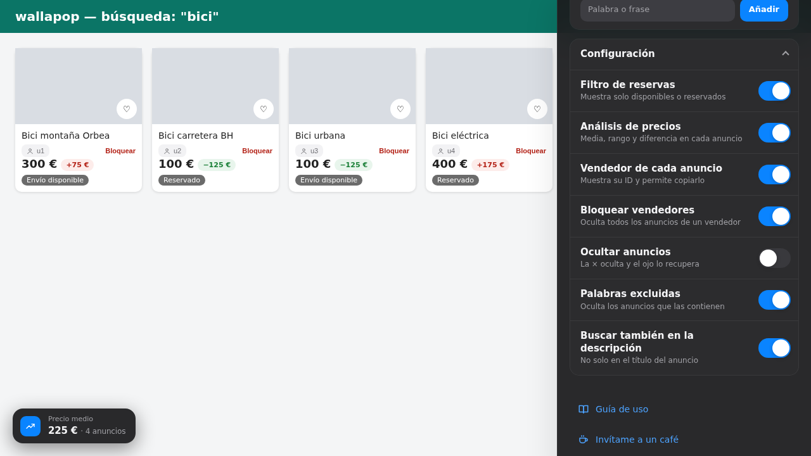

<div align="center">


# MarketLens

**Mira Wallapop con lupa.** Filtra los anuncios reservados, compara cada precio con la media de la búsqueda y oculta a los vendedores que no te interesan.

[](https://github.com/dierodfer/MarketLens/actions/workflows/ci.yml)
[](manifest.json)
[](https://developer.chrome.com/docs/extensions/develop/migrate/what-is-mv3)
[](tests/e2e)
[](content.js)
[](https://github.com/dierodfer/MarketLens/commits/master)

</div>

<p align="center">
  
  
</p>
<p align="center">
  
  
</p>
<p align="center">
  
  
</p>
<p align="center"><sub>Capturas generadas por los tests sobre una página que imita a Wallapop. En la segunda fila, anuncios ocultados a mano (ojo azul) y filtrados por palabras (círculo naranja), y abajo la configuración.</sub></p>

---

## Índice

- [Características](#características)
- [Instalación](#instalación)
- [Uso](#uso)
- [Cómo funciona](#cómo-funciona)
- [Desarrollo](#desarrollo)
- [Tests e integración continua](#tests-e-integración-continua)
- [Estructura del proyecto](#estructura-del-proyecto)
- [Contribuir](#contribuir)
- [Créditos](#créditos)

## Características

| | Función | Qué hace |
|---|---|---|
| 🔎 | **Filtro de reservas** | Muestra todos los anuncios, solo los disponibles o solo los reservados. Se aplica también a los que se cargan al hacer scroll. |
| 📈 | **Análisis de precios** | Calcula el precio medio y el rango de la búsqueda, y marca en cada anuncio cuánto está por encima (rojo) o por debajo (verde) de la media. |
| 🚫 | **Bloqueo de vendedores** | Muestra el ID del vendedor en cada anuncio (clic para copiarlo) y permite ocultar todos sus anuncios de una vez. |
| ✕ | **Ocultar anuncios** | Oculta un anuncio al momento y recalcula la media sin él. En su lugar queda una tarjeta con borde, con un ojo 👁 y «Anuncio oculto» en el centro; se pulsa en cualquier punto para volver a mostrarlo. Se recuerda al recargar o repetir la búsqueda. |
| 🔎 | **Palabras excluidas** | Escribe una palabra o frase en el panel y se ocultan los anuncios que la contienen, en el título o en la descripción. En su lugar queda una tarjeta con un círculo naranja y «Contiene «palabra»»; un clic la muestra unos segundos y vuelve a ocultarse sola. |
| 🌗 | **Modo claro y oscuro** | El panel sigue la apariencia del sistema. |
| ⚙️ | **Configuración por usuario** | Cada función se activa o desactiva desde el panel (ver más abajo). |
| 💾 | **Preferencias guardadas** | El filtro elegido, la configuración y los anuncios ocultos se recuerdan entre sesiones. |

## Instalación

> MarketLens todavía no está en la Chrome Web Store; se instala en modo desarrollador.

**Desde el código**

```bash
git clone https://github.com/dierodfer/MarketLens.git
```

**Desde una release**: descarga `marketlens-vX.Y.Z.zip` de la [página de releases](https://github.com/dierodfer/MarketLens/releases/latest) y descomprímelo.

**Desde CI**: cada ejecución en verde de [GitHub Actions](https://github.com/dierodfer/MarketLens/actions/workflows/ci.yml) publica el artefacto `marketlens-extension`, un `.zip` listo para descomprimir.

Después:

1. Abre `chrome://extensions/`.
2. Activa el **Modo de desarrollador** (arriba a la derecha).
3. Pulsa **Cargar descomprimida** y elige la carpeta del proyecto.

Probada en Chrome; debería funcionar en otros navegadores basados en Chromium (Edge, Brave…).

## Uso

1. Haz una búsqueda en [es.wallapop.com](https://es.wallapop.com).
2. Pulsa la pestaña de MarketLens en el borde derecho de la pantalla.
3. En **Mostrar**, elige **Todos**, **Disponibles** o **Reservados**.
4. En **Configuración** activa o desactiva las funciones que quieras.

| Elemento | Dónde | Para qué |
|---|---|---|
| Pestaña lateral | Borde derecho | Abre el panel. El punto indica el estado: verde activo, gris en pausa. |
| Configuración | Panel, sección plegable | Interruptor por función; el del filtro lo pausa sin perder la selección. |
| Pastilla de precio | Junto al precio de cada anuncio | Diferencia respecto a la media. |
| × / 👁 | Esquina superior derecha de cada anuncio | La × lo oculta al momento; la tarjeta que queda se pulsa entera para volver a mostrarlo. |
| Palabras excluidas | Panel | Campo para añadir palabras o frases, lista para quitarlas y cuántos anuncios ocultan en la página. |
| Chip del vendedor | Bajo el título | Clic para copiar su ID; **Bloquear** oculta todos sus anuncios. |
| Ocultos | Panel | Cuántos anuncios ocultos hay en la página y **Mostrar todos** para recuperarlos. |
| Precio medio | Esquina inferior izquierda | Media y número de anuncios analizados. |
| Icono de la barra | Barra de Chrome | Estado de la conexión con la pestaña de Wallapop. |

## Configuración

El panel tiene una sección plegable **Configuración** con un interruptor por función. Todas vienen activadas y cada usuario elige las suyas; se guardan en el navegador (`chrome.storage.local`).

| Interruptor | Qué cambia al desactivarlo |
|---|---|
| **Filtro de reservas** | Se muestran todos los anuncios. Elegir un modo en **Mostrar** lo vuelve a activar. |
| **Análisis de precios** | Desaparecen la tarjeta de precio medio, las pastillas de diferencia y las filas de precio medio y rango del panel. |
| **Vendedor de cada anuncio** | Desaparece el ID del vendedor (y, con él, el botón de bloquear). |
| **Bloquear vendedores** | Desaparece el botón **Bloquear** y la fila de bloqueados. Requiere que el vendedor se muestre. |
| **Ocultar anuncios** | Desaparecen la × y la fila **Ocultos**, y los anuncios ocultos vuelven a verse. Se recuerdan y vuelven a ocultarse al reactivarla. |
| **Palabras excluidas** | Se quita la sección del panel y dejan de filtrarse anuncios. La lista se conserva. |
| **Buscar también en la descripción** | Solo se comparan los títulos. Requiere «Palabras excluidas». |

Cómo se comparan las palabras: sin distinguir mayúsculas ni acentos (`electrica` encuentra «Eléctrica») y desde el principio de una palabra (`funda` encuentra «fundas», pero `tv` no encuentra «estuviera»). Una frase tiene que aparecer completa y en ese orden. La descripción no se ve en la tarjeta: se toma de la respuesta de la API de búsqueda de Wallapop, así que solo se puede comparar en los anuncios que esa respuesta incluye. Un anuncio ocultado a mano manda sobre uno filtrado por palabras.

Desactivar una función no deshace lo ya hecho: los vendedores que bloqueaste no vuelven hasta recargar la página.

## Cómo funciona

```
Wallapop ──fetch /api/v3/search──▶ inject.js ──postMessage──▶ content.js ──▶ panel, filtros y precios
                                   (contexto de la página)     (content script)
```

- **Productos**: se detectan con `.item-card_ItemCard--vertical__CNrfk` y, como respaldo, `a[href*="/item/"]`. Un `MutationObserver` aplica el filtro a los que se cargan después.
- **Reservas**: un anuncio está reservado si contiene `wallapop-badge[badge-type="reserved"]` o una insignia con el texto "Reservado".
- **Vendedores**: `inject.js` lee las respuestas de la API de búsqueda y `content.js` empareja cada anuncio con su vendedor por la URL de la imagen.
- **Preferencias**: se guardan con `chrome.storage.local`.

La extensión solo se ejecuta en `es.wallapop.com` y `www.wallapop.com` y no envía datos a ningún servidor.

## Desarrollo

Requisitos: **Node.js 24** (ver [`.nvmrc`](.nvmrc); funciona desde la 22) y npm.

```bash
npm install
npx playwright install chromium --no-shell   # solo la primera vez
```

| Comando | Qué hace |
|---|---|
| `npm run lint` | Comprueba la sintaxis de todos los scripts de la extensión. |
| `npm run test:unit` | Valida el manifest, los iconos y los ficheros referenciados. |
| `npm run test:e2e` | Carga la extensión en Chromium y la prueba sobre Wallapop simulado. |
| `npm test` | Todo lo anterior. |

Para depurar en una página real de Wallapop:

- `Alt+Shift+D`: resumen de disponibles y reservados en la consola.
- `testReservedFilter()` y `showAllProducts()` desde la consola de la página.

## Tests e integración continua

Los tests E2E usan [Playwright](https://playwright.dev) con la extensión cargada de verdad en Chromium. Wallapop, su API y las imágenes se sirven en local, así que los tests no dependen de la red ni de los cambios de la web real.

Wallapop usa dos formatos de tarjeta y cada test se ejecuta con los dos (proyectos `busqueda` y `perfil` de Playwright):

| Formato | Página simulada | Tarjeta |
|---|---|---|
| Búsqueda | [`tests/fixtures/search.html`](tests/fixtures/search.html) | `<article>` con un enlace en la imagen y otro en el título; el precio va fuera de ambos |
| Perfil de un vendedor | [`tests/fixtures/profile.html`](tests/fixtures/profile.html) | Toda la tarjeta es un `<a>` |

Qué se comprueba:

- El panel se inyecta una sola vez, se abre y se cierra, y no se duplica al navegar.
- Los filtros muestran los anuncios correctos y la preferencia sobrevive a una recarga.
- La media, el rango y las diferencias de precio son correctos y se recalculan al cargar más anuncios.
- Cada anuncio muestra su vendedor según la API; bloquearlo oculta sus anuncios y actualiza la media.
- Cada interruptor de la configuración activa o desactiva su función y se recuerda tras recargar.
- Ocultar un anuncio es inmediato, deja una tarjeta con un ojo para mostrarlo, recalcula la media, sobrevive a una recarga y se puede deshacer desde el panel.
- Una palabra excluida oculta por título o descripción, no distingue mayúsculas ni acentos, y el anuncio filtrado se puede ver unos segundos.
- Los diálogos son propios de la extensión, nunca `confirm()` del navegador.
- La página no lanza errores de JavaScript.

El workflow [`ci.yml`](.github/workflows/ci.yml) se ejecuta **solo en pull requests contra `master`** (y a mano desde la pestaña Actions). No se lanza en los push a `master` ni cuando la PR solo toca documentación (`*.md`, `docs/`).

Un único job ordenado de lo más barato a lo más caro, para fallar cuanto antes:

1. Sintaxis (`npm run lint`) y tests unitarios (`npm run test:unit`): no necesitan dependencias.
2. `npm ci` e instalación de Chromium (sin headless shell ni paquetes del sistema).
3. Tests E2E (`npm run test:e2e`). Si fallan, sube el informe de Playwright como artefacto `playwright-report`.
4. Si todo pasa, publica la extensión como artefacto `marketlens-extension`.

### Releases

La versión no se edita a mano: la calcula [semantic-release](https://semantic-release.gitbook.io) a partir de [commits convencionales](https://www.conventionalcommits.org). El workflow [`release.yml`](.github/workflows/release.yml) se lanza al fusionar en `master`:

1. Pasa lint, tests unitarios y E2E.
2. semantic-release analiza los commits desde la última etiqueta: `fix:` sube el parche, `feat:` la versión menor y `BREAKING CHANGE` la mayor. `chore:`, `docs:`, `ci:` o `test:` no publican nada.
3. Si toca publicar, actualiza `version` en `manifest.json` y `package.json`, crea el commit `chore(release)` y la etiqueta `vX.Y.Z`.
4. Crea la release de GitHub con notas generadas y adjunta `marketlens-vX.Y.Z.zip` (manifest, scripts, estilos e iconos).

La primera ejecución crea la etiqueta base `v0.0.0` (el manifest parte de `0.0.0`), así que la primera release es la `0.0.1` con el siguiente `fix:` (un `feat:` daría `0.1.0`).

Para publicar basta con fusionar a `master` una PR con commits convencionales. Si `master` tiene protección de rama, el workflow necesita poder subir el commit de versión (ver [`.releaserc.json`](.releaserc.json)).

Otras decisiones:

- **Concurrencia**: un push nuevo a la misma PR cancela la ejecución anterior que siga en curso.
- **Seguridad**: permisos de solo lectura, actions fijadas por SHA y checkout sin credenciales persistidas.
- **Actualizaciones**: [Dependabot](.github/dependabot.yml) propone cada semana las nuevas versiones de las actions y de Playwright.

Para usar un Chromium ya instalado en lugar del de Playwright: `CHROMIUM_PATH=/ruta/a/chromium npm run test:e2e`. Tiene que ser Chromium: Google Chrome no permite cargar extensiones desde la línea de comandos.

> Los tests no pueden detectar que Wallapop cambie su HTML o su API. Si la extensión deja de encontrar productos, revisa primero los selectores de `getSearchResults()` en `content.js`.

## Estructura del proyecto

```
MarketLens/
├── manifest.json            # Configuración de la extensión (Manifest V3)
├── content.js               # Panel, filtro, análisis de precios y bloqueo
├── inject.js                # Lee las respuestas de la API de búsqueda
├── background.js            # Service worker
├── styles.css               # Estilos del panel y de los elementos sobre las tarjetas
├── popup.html · popup.js    # Popup del icono de la extensión
├── icons/                   # Icono (SVG fuente y PNG 16/32/48/128)
├── docs/                    # Capturas del README
├── tests/
│   ├── unit/                # Tests del manifest (node:test)
│   ├── e2e/                 # Tests de Playwright y su fixture
│   └── fixtures/            # Wallapop simulado: búsqueda y perfil de vendedor
├── scripts/check-syntax.mjs
├── playwright.config.js
├── .releaserc.json          # Configuración de semantic-release
├── .nvmrc                   # Versión de Node.js
└── .github/
    ├── workflows/ci.yml     # CI en pull requests
    ├── workflows/release.yml # Release automática con semantic-release
    └── dependabot.yml       # Actualización semanal de actions, Playwright y semantic-release
```

## Contribuir

1. Haz un fork y crea una rama: `git checkout -b mi-mejora`.
2. Haz tus cambios y ejecuta `npm test`.
3. Abre un pull request; la CI tiene que quedar en verde.

¿Has encontrado un fallo? Abre un [issue](https://github.com/dierodfer/MarketLens/issues) con los pasos para reproducirlo y, si puedes, la URL de la búsqueda.

## Créditos

Basado en [Reserve Sniper](https://github.com/MartinGoDev/Reserve-Sniper-Extension) de [MartinGoDev](https://github.com/MartinGoDev).

Si te resulta útil, puedes apoyar al autor original:

[](https://buymeacoffee.com/martingodeg)
